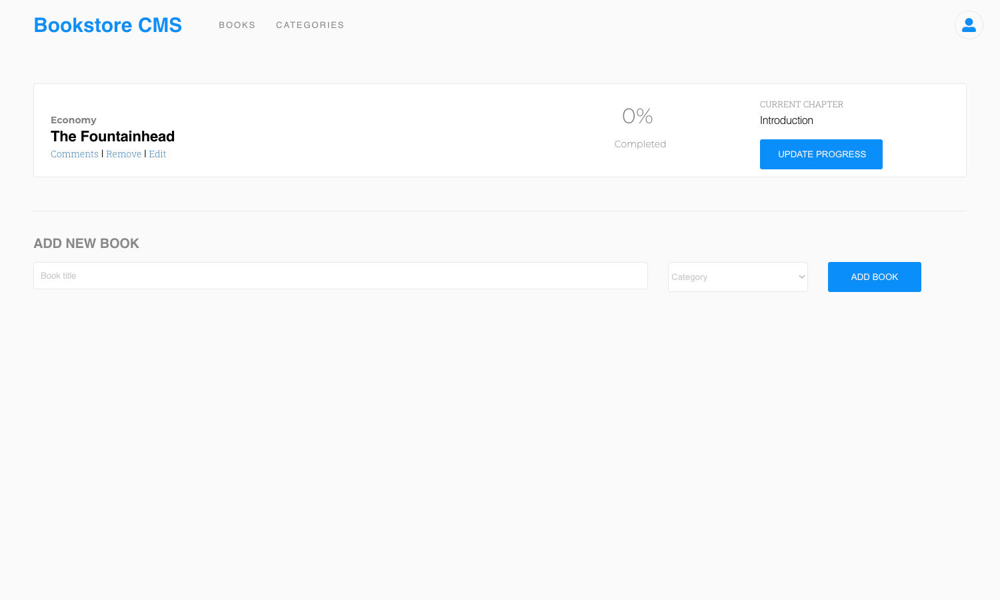

# Bookstore

> A react JS application that allows you to add books and track your reading progress.

## Built With

- JavaScript/React
- React Router
- JSX
- CSS
## Setup

- Get the link of the repository: `git@github.com:mmatongo/bookstore.git`
- Clone it as `git@github.com:mmatongo/bookstore.git` on a Terminal

## Usage

- Run `npm install` on a Terminal to install the modules
- Run `yarn start` on a Terminal to start the server 
- Open [http://localhost:3000/bookstore](http://localhost:3000/bookstore) to view it in the browser.

## Author

👤 **Daniel M. Matongo**

- GitHub: [@mmatongo](https://github.com/mmatongo)
- LinkedIn: [Daniel M. Matongo](https://linkedin.com/in/mmatongo)

## 🤝 Contributing

Contributions, issues, and feature requests are welcome!

## Show your support

Give a ⭐️ if you like this project!

## Acknowledgments

- Microverse
- React and React Router documentation
- Stack Overflow